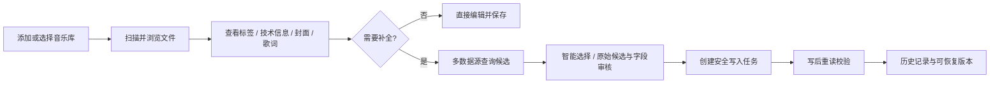
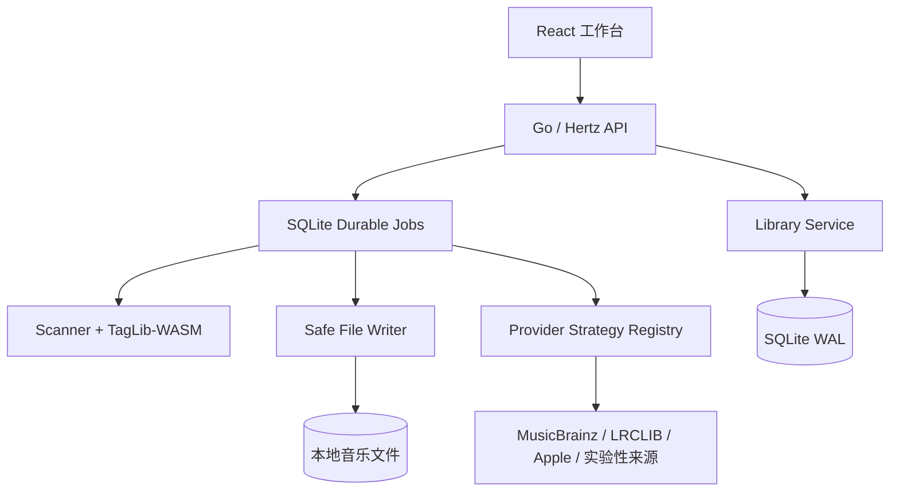

<p align="center">
  
</p>

<h1 align="center">Tagger</h1>

> 面向个人音乐档案的本地元数据工作台：浏览、匹配、审核，然后安全地写回音乐文件。

<p align="center">
  <strong>Local-first · Review-first · One binary</strong>
</p>


Tagger 是一个使用 Go 构建的本地音乐元数据管理工具。它把音乐文件当作事实源，在浏览器中读取和编辑 MP3、FLAC、WAV、Ogg Vorbis、Ogg Opus 和 M4A（MP4 容器，ALAC/AAC）的标签、歌词、封面和技术信息；需要补全时，再通过可插拔的数据源策略查询候选结果，并在逐字段审核后写回文件。

它不是音乐下载器，也不是面向公网的音乐流媒体服务。Tagger 的目标很简单：让个人音乐库的整理工作可解释、可恢复、可审计，并且在一台机器上用一个二进制文件启动。

## 为什么做 Tagger

音乐元数据整理通常同时面对三个问题：文件格式不统一、在线数据源不稳定、批量写入一旦出错就很难回退。Tagger 围绕这三个问题建立了几条明确的原则：

- **本地优先**：音频文件留在你的音乐目录中，SQLite 只保存可重建的索引、任务和标签级历史。
- **先审核再写入**：候选结果不是授权。标题、艺术家、专辑、歌词和封面都可以逐项选择，低置信度结果不会静默覆盖文件。
- **安全写入**：写入前检查 revision，使用临时副本、写后重读校验和原子替换；每次成功修改都留下差异和历史。
- **策略隔离**：MusicBrainz、LRCLIB、Apple/iTunes、网易云、酷我、酷狗和 LrcApi 都通过统一策略接口接入，单个来源失败不会阻断其他来源。

## 亮点一览

| 方向 | Tagger 提供的能力 |
| --- | --- |
| 音乐文件 | MP3、FLAC、WAV、Ogg Vorbis、Ogg Opus、M4A（MP4 容器，ALAC/AAC）的常用标签、原始 PropertyMap、时长、码率、采样率、位深、声道和嵌入封面 |
| 标签编辑 | 标题、艺术家、专辑、专辑艺术家、音轨/光盘号、年份、风格、歌词，以及注释、作曲家、指挥、作词家、版权、BPM、ISRC、MusicBrainz/AcoustID 标识 |
| 封面管理 | 读取、预览、上传、删除、远程候选预览；支持 JPEG/PNG/WebP 校验和 500×500 / 1000×1000 居中裁剪 |
| 数据补全 | 全部启用来源并行查询、跨源 Recording/Release 聚类、字段级智能选择、原始候选保留、歌词/封面独立采用和单曲重新匹配 |
| 批量任务 | 扫描、抓取、审核、写入和批量编辑使用 SQLite 持久化队列，支持进度、SSE 更新、取消、失败项重试和服务重启恢复 |
| 多曲库 | 启动时可以不提供音乐目录；设置页可添加、探测、切换多个本地曲库，目录以可折叠树状结构浏览 |
| 曲目浏览 | 服务端过滤/排序与游标分页，首屏默认 100 首，滚动追加；搜索、目录、递归、状态和格式条件不会把整座曲库加载到浏览器 |
| 页面恢复 | 同一 SPA 会话保留已加载页、筛选、跨页选择、当前曲目和滚动位置；整页刷新只恢复轻量筛选与滚动锚点，再按游标请求数据 |
| 批量安全 | “全选”针对当前服务端结果集，批量补全/编辑/快照默认单次最多 2000 首；可在“设置 → 系统与安全”中调高，超限时提示先缩小范围 |
| 使用体验 | 跨页面全局播放器、浏览器路由、历史记录、主题/字体切换、无效封面默认留白、单用户可选访问令牌 |
| 部署 | React 生产构建嵌入 Go 服务，运行时不需要 Node.js、FFmpeg 或系统 TagLib |
| 整轨 CUE | 整轨 WAV/FLAC + .cue 专辑自动展开为虚拟曲目：刮削、审核、歌词一应俱全，**网页试听可按 cue 选曲精确播放**，音频文件零改动（本 fork，v1.3.0 起；v1.4.3 起非 WAV 整轨支持选曲） |
| 歌词 .lrc | 歌词页、刮削面板、批量审核页都可勾选「导出 .lrc」把歌词另存为独立文件（普通曲目是「内嵌之外再存一份」，整轨 CUE 虚拟轨道则由你决定要不要歌词）（本 fork，v1.4.4 起；v1.4.5 起整轨亦可选；v1.4.6 起刮削面板支持；v1.4.7 起批量审核页支持） |
| 桌面客户端 | Windows 版默认弹出 WebView2 原生窗口（`-ui=window`），点关闭按钮即退出程序；可切浏览器模式或纯服务（本 fork，v1.4.0 起） |

## 本 fork 的增量（ttbb1211/tagger）

本仓库是 [Ericwyn/tagger](https://github.com/Ericwyn/tagger) 的 fork，在上游基础上做了以下增强（2026-09-26）：

- **整轨 CUE 专辑支持**（v1.3.0）：导入「整轨 WAV/FLAC + .cue」专辑自动展开为虚拟曲目，**音频文件零改动**——元数据写回 cue 文本文件（GBK/UTF-8 往返），歌词落 `.NNN.lrc` sidecar，封面专辑级共享；网页试听可**按 cue 选曲精确播放**——WAV 由服务端按 RIFF data 块字节区间切段，FLAC 等其余格式由播放器按 cue 偏移量 seek 到该曲区间并在段尾停止（非 WAV 选曲自 v1.4.3 起支持）。
- **Windows 桌面版**（v1.4.0 起）：GitHub Actions 自动构建 Windows x86_64 **安装包 + 便携版**（`build-windows.yml`）。双击启动即弹出 **WebView2 原生窗口**（`-ui=window`，默认档），**点窗口关闭按钮直接退出程序、不常驻后台**；亦可用 `-ui=browser` 回退浏览器、`-ui=server` 纯服务。安装向导可选择音乐库目录（支持勾选「暂不设置，安装完成后手动指定」），数据目录独立于安装目录，服务仅监听 `127.0.0.1:8080`。产物在 Releases 页与各次构建的 Artifacts 区。
- **歌词可导出 `.lrc`**（v1.4.4，v1.4.5 起整轨改为可选，v1.4.6 起刮削面板支持，v1.4.7 起批量审核页支持）：歌词页、「查找资料」刮削面板与批量审核页都提供「导出 .lrc 歌词文件」选项——普通曲目可与内嵌歌词并存，写成同目录同名的 `.lrc`；**整轨 CUE 虚拟轨道同样可选、默认不勾**（虚拟轨道没有独立音频文件、歌词无法内嵌，勾选后写成 `<父音频>.<轨号>.lrc`；不勾选则歌词只保留在曲库索引中，完整重扫会丢失，保存时界面会明确提示）。歌词清空且已存在 `.lrc` 时会一并删除该文件。v1.4.6 起写入结果会把**后端字段级告警**一并显示（例如整轨虚拟轨道写歌词会提示「CUE 不支持字段 lyrics」），不再出现「提示成功但实际没落盘」。
- **`.lrc` 命名规则与播放器兼容性**：**普通曲目**写成**与音频同名**的 `.lrc`（`歌曲.flac` → `歌曲.lrc`，文件名里的空格与 `[ALAC] [24 bit - 48.0 kHz]` 之类标记原样保留）——这是业界通用约定，Navidrome、foobar2000 等按同名查找，**可直接读到**。**整轨虚拟轨道**的 `<父音频>.<轨号>.lrc`（如 `专辑.wav` 第 3 轨 → `专辑.003.lrc`）是 Tagger 自己的约定，作用是**让每轨歌词落盘并被重扫读回**（不导出则只留在曲库索引、完整重扫即丢）；**通用播放器不会读带轨号的文件**——它们只会去找整轨音频同名的单份 `.lrc`，所以整轨在外部播放器里通常看不到歌词。若要让播放器里每首都有歌词，需先用其它工具把整轨切成独立音频文件。
- **M4A 支持**：格式白名单加入 `.m4a`（MP4 容器，ALAC/AAC），扫描、刮削、标签/歌词写入与网页播放全覆盖。
- **Windows 启动修复**：SQLite DSN 对 Windows 盘符路径生成 `file:///C:/...` 三斜杠 URI，修复 `invalid uri authority: C:` 导致的启动即退。
- **CI 约定**：纯文档改动不触发构建（`paths-ignore`）；commit message 加 `[skip ci]` 可单次跳过。

上述修复计划向上游提交 PR。**Windows/macOS/Linux 用户可直接从 [Releases](https://github.com/ttbb1211/tagger/releases) 下载安装包与各架构二进制**（当前 v1.4.7）。注意：下文「快速开始」中的 Docker 镜像名仍指向上游 `ghcr.io/ericwyn/tagger`（fork 未改），自建镜像请直接用本仓库源码 `docker build`。

## 一次典型的整理流程



### 主要界面

- **曲库**：左侧曲库和目录树，顶部搜索/格式/状态/递归过滤，中间曲目列表，右侧 Inspector 查看和编辑元数据。
- **分页浏览**：曲目查询由 Go 服务端执行，首次只取约 100 首；继续滚动会用不透明游标追加下一页，底部显示已加载数量和匹配总数。离开曲库去任务、历史、设置或审核页再返回时，列表和滚动位置会恢复。
- **审核抓取结果**：本地值与“智能选择 / 原始数据源”候选对比，逐字段显示真实来源，支持全选/取消、候选切换、歌词/封面详情预览、封面写入尺寸和连续审核。
- **任务中心**：扫描、抓取、写入和批量编辑的持久化状态；显示处理进度、失败原因、取消和重试入口。
- **历史**：按曲目查看字段 diff、标签快照和封面 blob，先预览再恢复，恢复本身也会产生新的审计记录。
- **设置**：曲库注册与切换、数据源启用/配置/测试、主题字体、历史保留策略、封面占位和安全写入开关。

#### 界面预览

下面是当前工作台的代表性页面。截图只用于快速理解操作流程，实际能力以运行中的界面和上方功能说明为准；图片已统一压缩到适合文档阅读的尺寸。

<table>
  <tr>
    <td width="50%" valign="top">
      
      <br />
      <sub><strong>曲库列表</strong> · 按目录浏览、筛选和检查音乐标签</sub>
    </td>
    <td width="50%" valign="top">
      
      <br />
      <sub><strong>任务中心</strong> · 追踪扫描、匹配与写入任务进度</sub>
    </td>
  </tr>
  <tr>
    <td width="50%" valign="top">
      
      <br />
      <sub><strong>审核结果页</strong> · 逐字段审核候选值后再创建写入任务</sub>
    </td>
    <td width="50%" valign="top">
      
      <br />
      <sub><strong>查询结果页</strong> · 查看多数据源候选、封面与歌词</sub>
    </td>
  </tr>
  <tr>
    <td width="50%" valign="top">
      
      <br />
      <sub><strong>数据源设置</strong> · 配置 MusicBrainz、LRCLIB 等来源</sub>
    </td>
    <td width="50%" valign="top">
      
      <br />
      <sub><strong>音乐目录设置</strong> · 注册、探测和切换本地曲库</sub>
    </td>
  </tr>
</table>

## 数据源策略

数据源是可配置的策略，而不是散落在页面里的特殊分支。每个策略可以声明自己的 API 地址、User-Agent、限流间隔、可选 HTTP 代理和鉴权字段；敏感配置会在本地加密保存，界面返回时自动脱敏。

同一首歌曲会并行查询所有已选数据源；同一个数据源则最多保留一个在途 HTTP 请求，搜索、歌词、自动重试和封面下载共同遵守该来源的请求间隔。批量抓取使用最多 2 首曲目的受控流水线，但每个来源仍由同一个 Gate 串行执行，因此不会用曲目并发绕过来源限流。

自动批量抓取默认每个来源保留 2 个候选，减少网易云、酷我和酷狗逐候选获取歌词产生的额外请求；审核页手动重新匹配仍保留每源 5 个候选，便于处理版本歧义。

| 数据源 | 主要用途 | 默认状态 |
| --- | --- | --- |
| [MusicBrainz](https://musicbrainz.org/) | 结构化歌曲、专辑、发行和外部 ID | 开启 |
| [LRCLIB](https://lrclib.net/) | 普通歌词和同步 LRC 歌词 | 开启 |
| Apple / iTunes | 目录搜索、版本信息和封面 | 可用，按需配置 |
| 网易云音乐 | 中文曲库、歌词和封面补充 | 实验性，默认关闭 |
| 酷我音乐 | 中文曲库、同步歌词和封面补充 | 实验性，默认关闭 |
| 酷狗音乐 | 中文曲库、LRC 歌词和封面补充 | 实验性，默认关闭 |
| [LrcApi](https://github.com/HisAtri/LrcApi) | 可自托管的歌词/封面聚合接口 | 实验性，默认关闭 |

每个来源的 `HTTP 代理 URL` 接受无鉴权的 `http://` 或 `https://` 代理地址，例如 `http://127.0.0.1:7890`，并覆盖该来源的搜索、歌词、元数据与封面请求；留空时沿用进程的 `HTTP_PROXY`、`HTTPS_PROXY` 和 `NO_PROXY`，未设置环境代理时直接连接。当前不支持 SOCKS、PAC 或在代理 URL 中携带用户名密码。

MusicBrainz 的结构化查询和封面下载分别配置：`API Base URL` 用于查询 recording，`Internet Archive 下载基址` 用于改写 Cover Art Archive 返回的 `archive.org/download/...` 地址。后者默认是 `https://archive.org`，既可以填写兼容 `/download/{item}/{file}` 的 HTTPS 镜像 origin，也可以填写会继续拼接该路径的代理前缀，例如 `https://vercel-proxy.example/https/archive.org`；改写后的镜像请求仍会经过该来源配置的 HTTP 代理。

所有远程封面都会经过安全代理、MIME/尺寸校验和短期磁盘缓存；来源没有可用封面时，界面默认显示空白，不使用自动生成图片干扰审核。网易云、酷我、酷狗等非官方接口可能随时变化，是否启用由用户自己决定。

## 安全写入模型

Tagger 把“查询”和“写入”明确分开。一次批量补全不会直接修改文件，而是经过以下状态：

1. 数据源返回候选并计算匹配度。
2. 用户查看当前值与候选值的差异，逐字段选择要采用的内容。
3. 用户明确确认后创建写入任务；歌词和封面可以独立选择。
4. 写入前检查文件 revision，防止外部程序修改后覆盖新内容。
5. 在临时副本上写入并重读验证，通过后原子替换原文件。
6. 记录字段 diff、前后标签快照、封面信息和来源，失败项独立保留。

因此，**请把 Tagger 当作会修改文件的工具使用，并在首次批量操作前备份音乐目录**。安全写入和历史恢复降低了风险，但不能替代文件系统备份。

## 快速开始

### 支持的平台

| 平台 | 部署方式 |
| --- | --- |
| Windows 10/11（x64） | Releases 页**安装版 / 便携版**（v1.2.0 起，fork 提供） |
| Linux amd64 | Releases 页预编译二进制 / Docker 镜像 |
| Linux arm64（甲骨文 A1、树莓派等） | Releases 页预编译二进制（v1.2.0 起）/ Docker 镜像 |
| 群晖 / 威联通 / Unraid / TrueNAS | Docker 镜像 |

二进制从 [Releases](https://github.com/ttbb1211/tagger/releases) 页下载（amd64 与 arm64 双架构）。Docker 镜像两个来源均可用、均为 amd64+arm64 双架构：本 fork 的 `ghcr.io/ttbb1211/tagger`（跟随 Releases 发版）与上游的 `ghcr.io/ericwyn/tagger`。其他平台可从源码交叉编译：项目以 `CGO_ENABLED=0` 构建，TagLib 以 WebAssembly 形式嵌入，交叉编译不需要 C 工具链。

### 构建要求

- Go `1.25.7` 或更高版本
- Node.js `20+` 和 npm（仅构建前端时需要）
- 运行已构建的二进制不需要 Node.js、FFmpeg 或外部 TagLib

### 构建并启动

```bash
make build
./dist/tagger \
  --music-dir /path/to/music \
  --data-dir /path/to/tagger-data
```

默认监听 `127.0.0.1:8080`，打开 <http://127.0.0.1:8080> 即可使用。生产构建必须使用 `make build`，它会先编译 React，再把 `frontend/dist` 复制到 `web/dist`，最后嵌入 Go 二进制。

如果不想在启动时指定音乐目录，也可以直接启动：

```bash
./dist/tagger --data-dir ./data
```

然后在设置页探测并添加音乐库。配置过的活动曲库会保存在 SQLite 中，后续启动时自动恢复；如果目录已经失效，Tagger 会保留旧索引并明确显示“未配置活动曲库”。

### 数据源命令行诊断

使用同一个数据目录可以加载当前保存的端点、代理和鉴权配置，对全部内置数据源执行实时查询并退出；诊断模式不会扫描曲库或启动 HTTP 服务。它会绕过搜索缓存，默认检查每个候选的歌词并实际下载、解码和验证封面。即使某个实验性来源在设置中暂时关闭，也会被纳入测试，但不会改变其启用状态。

```bash
./dist/tagger --data-dir ./data --test-providers
```

也可以指定测试歌曲、每个来源保留的候选数，或输出适合脚本处理的 JSON：

```bash
./dist/tagger --data-dir ./data --test-providers \
  --test-title "Easy On Me" \
  --test-artists "Adele" \
  --test-album "30" \
  --test-duration 225 \
  --test-limit 3 \
  --test-json
```

不想下载封面时使用 `--test-artwork=false`。搜索或封面探测失败时进程退出码为 `1`；没有候选、候选缺少来源声明支持的歌词或封面只记为 warning，退出码仍为 `0`。

### 使用 Docker

正式发布的多架构镜像位于 `ghcr.io/ericwyn/tagger`，支持 `linux/amd64` 和 `linux/arm64`。音乐目录和运行数据需要分别挂载：

```bash
docker run -d \
  --name tagger \
  --restart unless-stopped \
  -p 127.0.0.1:8080:8080 \
  -v /path/to/music:/music:rw \
  -v /path/to/tagger-data:/data:rw \
  -e TAGGER_MUSIC_DIR=/music \
  -e TAGGER_DATA_DIR=/data \
  -e TAGGER_AUTH_TOKEN='replace-with-a-long-random-token' \
  ghcr.io/ericwyn/tagger:latest
```

镜像默认设置 `TAGGER_LISTEN=0.0.0.0:8080`、`TAGGER_MUSIC_DIR=/music` 和 `TAGGER_DATA_DIR=/data`；这些值及 `TAGGER_AUTH_TOKEN` 都可以在运行容器时覆盖。镜像以 UID/GID `10001` 的非 root 用户运行，宿主机挂载目录必须允许该用户读写；首次只想检查标签时，可以先把音乐目录挂载为只读的 `/music:ro`。

#### 使用宿主机 UID/GID

如果宿主机或 NAS 上的音乐目录不属于 `10001:10001`，推荐在创建容器时通过 Docker 原生的 `--user UID:GID` 覆盖默认身份。先查看当前用户以及音乐目录的数字所有者：

```bash
id
id -u
id -g
stat -c '%u:%g' /path/to/music
```

例如，让 Tagger 使用当前登录用户的 UID/GID：

```bash
docker run -d \
  --name tagger \
  --restart unless-stopped \
  --user "$(id -u):$(id -g)" \
  -p 127.0.0.1:8080:8080 \
  -v /path/to/music:/music:rw \
  -v /path/to/tagger-data:/data:rw \
  -e TAGGER_AUTH_TOKEN='replace-with-a-long-random-token' \
  ghcr.io/ericwyn/tagger:latest
```

Docker Compose 可以使用 `.env` 中的变量：

```yaml
services:
  tagger:
    image: ghcr.io/ericwyn/tagger:latest
    user: "${TAGGER_UID:-10001}:${TAGGER_GID:-10001}"
    volumes:
      - /path/to/music:/music:rw
      - /path/to/tagger-data:/data:rw
```

```dotenv
TAGGER_UID=1000
TAGGER_GID=1000
```

`/music` 中每个目标文件的父目录必须允许该身份读取、写入和进入，`/data` 也必须可写。Tagger 的安全写入会在音乐文件同目录创建临时副本，因此只修改文件本身的权限还不够。如果目录依赖共享组权限，可以额外使用 Docker 的 `--group-add <GID>`。不建议自动递归修改整个音乐库的所有者；对 NAS、NFS 或 SMB 挂载，应优先保持宿主机现有权限模型并选择匹配的 UID/GID。容器启动后可用 `docker exec tagger id` 确认实际身份。

默认分支构建会发布 `edge` 和 `sha-<commit>` 标签。正式 GitHub Release 会发布完整、主次版本标签以及 `latest`；预发布版本只更新其精确版本标签，不覆盖 `latest`。

### 启用单用户访问令牌

默认不启用鉴权。需要时可以在启动参数或环境变量中配置一个实例级令牌：

```bash
./dist/tagger \
  --music-dir /path/to/music \
  --auth-token 'replace-with-a-long-random-token'

# 或
TAGGER_AUTH_TOKEN='replace-with-a-long-random-token' \
  ./dist/tagger --music-dir /path/to/music
```

这是单用户令牌，不包含管理员账号、角色、设备管理或多租户会话。浏览器首次输入后通过同源 HttpOnly cookie 保持登录；API 客户端使用 `Authorization: Bearer <token>`。健康检查和嵌入式静态资源保持公开。

## 配置参考

| CLI 参数 | 环境变量 | 默认值 | 说明 |
| --- | --- | --- | --- |
| `--listen` | `TAGGER_LISTEN` | `127.0.0.1:8080` | 启动时的 HTTP 监听地址；运行后不在设置页修改 |
| `--music-dir` | `TAGGER_MUSIC_DIR` | 空 | 初始音乐根目录；也可以启动后从设置页添加 |
| `--data-dir` | `TAGGER_DATA_DIR` | `./data` | SQLite、密钥、缓存和运行数据目录 |
| `--library-name` | `TAGGER_LIBRARY_NAME` | 空 | 初始曲库显示名称 |
| `--auth-token` | `TAGGER_AUTH_TOKEN` | 空 | 可选单用户访问令牌 |
| `--scan-workers` | `TAGGER_SCAN_WORKERS` | `min(CPU, 8)` | 并行扫描 worker，范围 `1–32` |
| `--watch-mode` | `TAGGER_WATCH_MODE` | `auto` | 文件更新策略：`auto` 优先 fsnotify，`events` 强制事件模式，`poll` 使用当前目录轮询 |
| `--watcher-wait` | `TAGGER_WATCHER_WAIT` | `5s` | 文件变化事件合并等待时间，范围 `0–10m` |
| `--reconcile-interval` | `TAGGER_RECONCILE_INTERVAL` | `0`（关闭） | 低频增量对账间隔，范围 `0–720h` |

LrcApi 也可以在启动时通过 `TAGGER_LRCAPI_URL`、`TAGGER_LRCAPI_COVER_URL` 和 `TAGGER_LRCAPI_AUTH` 提供初始地址/鉴权；其他数据源优先在设置页配置。数据目录中可能包含 `.tagger-secrets.key`，请将整个数据目录视为敏感配置并限制访问权限。

## 开发

分别启动 Go 后端和 Vite 前端：

```bash
make dev-backend MUSIC_DIR=/path/to/music
make dev-frontend
```

Vite 会把 `/api`、`/healthz` 和 `/readyz` 代理到 `127.0.0.1:8080`。只想查看前端交互时，可以使用不依赖真实后端的 Mock 模式：

```bash
make dev-frontend-mock
```

常用命令：

```bash
make build                 # 前端构建 + Go 单二进制
make test                  # Go + 前端测试
make lint                  # go vet + TypeScript 类型检查
make test-integration MUSIC_DIR=/path/to/TestMusic
make clean
```

真实音频只作为本地集成语料，不提交到仓库。写入测试会把 MP3/FLAC 复制到临时目录，WAV 测试现场生成短 PCM 文件，不修改原始测试曲库。

## 项目结构

```text
cmd/tagger/          程序入口、依赖组装和任务 worker
internal/domain/     前后端共用的领域模型
internal/scanner/    文件发现、并发扫描和元数据读取
internal/tags/       标签引擎接口与 TagLib-WASM 适配器
internal/filewrite/  revision、临时副本、原子替换和写后校验
internal/providers/  数据源策略、评分、缓存和封面安全代理
internal/jobs/       SQLite 持久化队列、worker、SSE 事件
internal/library/    曲库索引、目录切换和曲目查询
internal/store/      SQLite migration、历史、配置和任务快照
internal/server/     HTTP API、鉴权、健康检查和 SPA fallback
frontend/            React 19 + TypeScript + Vite 工作台
web/                 go:embed 静态资源入口
docs/                前期设计、实现记录和持续任务列表
```



前后端不是两个需要分别部署的服务：生产构建时，Vite 的 `dist` 会被 `go:embed` 嵌入 Go 服务，最终只发布一个可执行文件。

## 路线图

当前主线已经覆盖“读取 → 匹配 → 审核 → 安全写入 → 历史恢复”。后续会优先考虑：

- 文件系统监听与定时对账，减少大型曲库的手动扫描次数。
- 更多容器/标签格式的兼容性验证，例如 OGG/Opus 和格式专有字段（M4A/ALAC 已于 2026-09-25 在本 fork 支持，计划 PR 回上游）。
- 专辑级一对一曲目分配、按需音频指纹和可选的 AI 歧义筛选。
- 发布包、跨平台构建和自动化 CI 的完善（Windows x86_64 构建与安装包 CI 已在本 fork 落地）。

明确不在当前目标内：下载或破解音乐内容、自动整理/重命名整座曲库、公开互联网 SaaS、多租户账号系统和未经确认的全库覆盖。

## 灵感与参考

Tagger 的产品边界和实现思路参考了以下开源项目与标准，但没有复制它们的页面资产或业务代码：

- [music-tag-web](https://github.com/xhongc/music-tag-web)：文件树、候选搜索和标签工作台的产品启发
- [Navidrome](https://github.com/navidrome/navidrome)：大型曲库扫描、索引和文件变化处理思路
- [MusicBrainz Picard](https://picard.musicbrainz.org/)：候选匹配、审核后保存的工作流
- [beets](https://github.com/beetbox/beets)：匹配评分和可选数据源设计
- [TagLib](https://taglib.org/) / [go-taglib](https://github.com/sentriz/go-taglib)：跨格式元数据读写能力
- [LrcApi](https://github.com/HisAtri/LrcApi)：歌词与封面聚合策略的参考

## 参与贡献

欢迎提交 Issue、复现步骤、数据源诊断日志和可验证的改进建议。涉及真实文件写入时，请同时说明文件格式、标签字段、当前 revision 和是否可以提供脱敏样本。

提交代码前建议运行：

```bash
make test
make lint
```

数据源适配器应遵循 `internal/providers` 中的策略接口，不能绕过统一限流、缓存、来源记录和封面安全校验。任何写入相关改动都应补充“写入后重读”或 revision 冲突测试。

## 许可证说明

除下述第三方组件外，Tagger 的原创源代码以 [MIT License](LICENSE) 发布。该许可证允许在保留版权和许可声明的前提下使用、复制、修改、再发布和商业分发。

本项目使用 `go.senan.xyz/taglib` v0.14.0，并将其基于 TagLib v2.1.1 构建的 `taglib.wasm` 嵌入最终 Go 可执行文件。该组件按 GNU LGPL v2.1 授权，不因本项目的 MIT License 而重新授权；分发包含该组件的源码或二进制时，请保留其上游声明并履行 LGPL-2.1 的适用义务。详见 [第三方声明](THIRD-PARTY-NOTICES.md)。

其他 Go 和 npm 依赖也继续按各自上游许可证授权。音乐文件、歌词、封面、元数据及外部数据源返回内容的版权和服务条款不因本项目许可证而改变，使用时请自行获得必要授权并遵守相应条款。

## 友情链接

- [HDCDAPE 音乐论坛](https://www.hdcdape.com/)
